# Ejercicios Tema 4

## Ejercicio 4.1 Buscar información sobre cuánto costaría en la actualidad un mainframe. Comparar precio y potencia entre esa máquina y una granja web de unas prestaciones similares. 

En IBM podemos encontrar los mainframes zEnterprise

* Generación anterior
	* IBM EC12
	* IBM BC12
* Generación actual
	* IBM z13
	* BM z13s

En Fujitsu podemos encontrar los Fujitsu Server GS21
	
* Modelos actuales
	* 2600
	* 2400
* Modelos antiguos
	* 1600
	* 1400
	* 900
	* 600
	* 500
	* 400
	* 200A
	* Gs8900
	* GS8500
	* GS8500FX
	* GS8800
	* GS8300

Con los mainframes actuales de las dos marcas, las caracteristicas quedarían algo así:

<table>
  <tr>
    <th>Marca</th>
    <th colspan="2">IBM</th>
    <th colspan="2">Fujitsu</th>
  </tr>
  <tr>
    <td>Modelo</td>
    <td>z13</td>
    <td>z13s</td>
    <td>2600</td>
    <td>2400</td>
  </tr>
  <tr>
    <td>Memoria</td>
    <td>64GB-10240GB</td>
    <td>64GB-4096GB</td>
    <td>[]-256GB</td>
    <td>[]-64GB</td>
  </tr>
  <tr>
    <td>Canales</td>
    <td>96-320</td>
    <td>96-128</td>
    <td>[]-256</td>
    <td>[]-256</td>
  </tr>
  <tr>
    <td>CPU</td>
    <td>Octa-Core 5Ghz</td>
    <td>Octa-Core 5Ghz</td>
    <td>Octa-Core</td>
    <td>Octa-Core</td>
  </tr>
</table>

En las paginas no podemos obtener ningun precio específico si comparamos en el mercado computadores con unos microprocesadores lo más parecido a la frecuencia de reloj del IBM z13 teniendo en cuenta la cantidad total de la memoria del mainframe de IBM puede ser de 10240GB 

<table>
  <tr>
    <th>Comparación</th>
    <th>CPU</th>
    <th>RAM</th>
    <th>Número total máquinas</th>
    <th>Precio Máquina</th>
    <th>Precio Total</th>
  </tr>
  <tr>
    <td>IBM</td>
    <td>Octa-core 5GHz</td>
    <td>10240</td>
    <td></td>
    <td></td>
    <td></td>
  </tr>
  <tr>
    <td>Ordenador</td>
    <td>Octa-Core 3,4GHz-4Ghz</td>
    <td>16GB</td>
    <td>640</td>
    <td>1100€</td>
    <td>640.000€</td>
  </tr>
</table>

## Ejercicio 4.2 Buscar información sobre precio y características de balanceadores hardware específicos. Compara las prestaciones que ofrecen unos y otros.

* F5 Networks
	* Serie BIG-IP i10000
	* Serie BIG-IP i7000
	* Serie BIG-IP i5000
	* Serie BIG-IP i4000
	* Serie BIG-IP i2000
* KEMP LoadMaster
	* LM-3000	
	* LM-3400	
	* LM-4000	
	* LM-5600	
	* LM-8000	
	* LM-8020	
	* LM-8020M	
	* LM-8020-FIPS 
* Tp-Link
	* TL-R480T+

<table>
<tbody>
	  	<tr class="prod">
			<th class="prod col">Balanceador</th>
			<th class="prod kemp">Serie BIG-IP i10000</th>
			<th class="prod kemp"> Serie BIG-IP i7000</th>
			<th class="prod kemp"> Serie BIG-IP i5000</th>
			<th class="prod kemp"> Serie BIG-IP i4000</th>
			<th class="prod kemp"> Serie BIG-IP i2000</th>
		</tr>

		<tr class="prodh pricing">
			<td class="prodLh">Pricing</td>
			<td class="prodh">-</td>
			<td class="prodh">-</td>
			<td class="prodh">-</td>
			<td class="prodh">-</td>
			<td class="prodh">-</td>
		</tr>
		<tr class="prod specs">
			<td class="prod">Specifications</td>
			<td>&nbsp;</td>
			<td>&nbsp;</td>
			<td>&nbsp;</td>
			<td>&nbsp;</td>
			<td>&nbsp;</td>
		</tr>
		<tr class="prod">
			<td class="prod col1">Application Throughput</td>
			<td class="prod">N/A</td>
			<td class="prod">N/A</td>
			<td class="prod">N/A</td>
			<td class="prod">N/A</td>
			<td class="prod">N/A</td>
			
		</tr>
</tbody>

<table>

<table class="table table-striped">
		<tbody><tr class="prodtable">
			<th class="prodtable col">Balanceador</th>
			<th class="prodtable kemp">LM-3000</th>
			<th class="prodtable kemp">LM-3400</th>
			<th class="prodtable kemp">LM-4000</th>
			<th class="prodtable kemp">LM-5600</th>
			<th class="prodtable kemp">LM-8000</th>
			<th class="prodtable kemp">LM-8020</th>
			<th class="prodtable kemp">LM-8020M</th>
			<th class="prodtable kemp">LM-8020-FIPS *</th>
		</tr>
		<tr class="prodtableh pricing">
			<td class="prodtableLh">Pricing</td>
			<td class="prodtableh">-</td>
			<td class="prodtableh">-</td>
			<td class="prodtableh">-</td>
			<td class="prodtableh">-</td>
			<td class="prodtableh">-</td>
			<td class="prodtableh">-</td>
			<td class="prodtableh">-</td>
			<td class="prodtableh">-</td>
		</tr>
		<tr class="prodtable specs">
			<td class="prodtable">Specifications</td>
			<td>-</td>
			<td>-</td>
			<td>-</td>
			<td>-</td>
			<td>-</td>
			<td>-</td>
			<td>-</td>
			<td>-</td>
		</tr>
		<tr class="prodtable">
			<td class="prodtable col1">Application Throughput</td>
			<td class="prodtable">1.7Gbps</td>
			<td class="prodtable">3.4Gbps</td>
			<td class="prodtable">8.0Gbps</td>
			<td class="prodtable">11Gbps</td>
			<td class="prodtable">20Gbps</td>
			<td class="prodtable">30Gbps</td>
			<td class="prodtable">30Gbps</td>
			<td class="prodtable">30Gbps</td>
		</tr>
		<tr class="prodtableh">
			<td class="prodtableh col1">Gigabit Ethernet Ports</td>
			<td class="prodtableh">4</td>
			<td class="prodtableh">8</td>
			<td class="prodtableh">2</td>
			<td class="prodtableh">4</td>
			<td class="prodtableh">0</td>
			<td class="prodtableh">0</td>
			<td class="prodtableh">0</td>
			<td class="prodtableh">0</td>
		</tr>
		<tr class="prodtable">
			<td class="prodtable col1">10 Gigabit Fiber Ports (SFP+)</td>
			<td class="prodtable">N/A</td>
			<td class="prodtable">N/A</td>
			<td class="prodtable">2</td>
			<td class="prodtable">2</td>
			<td class="prodtable">6</td>
			<td class="prodtable">8</td>
			<td class="prodtable">8</td>
			<td class="prodtable">8</td>
		</tr>
		<tr class="prodtableh">
			<td class="prodtableh col1">SSL TPS (2K Keys)</td>
			<td class="prodtableh">1,000</td>
			<td class="prodtableh">2,000</td>
			<td class="prodtableh">3,000</td>
			<td class="prodtableh">10,000</td>
			<td class="prodtableh">16,000</td>
			<td class="prodtableh">30,000</td>
			<td class="prodtableh">30,000</td>
			<td class="prodtableh">9,000</td>
		</tr>
		<tr class="prodtable">
			<td class="prodtable col1">SSL TPS (1K Keys)</td>
			<td class="prodtable">2,000</td>
			<td class="prodtable">4,000</td>
			<td class="prodtable">6,000</td>
			<td class="prodtable">17,000</td>
			<td class="prodtable">25,000</td>
			<td class="prodtable">46,000</td>
			<td class="prodtable">46,000</td>
			<td class="prodtable">N/A</td>
		</tr>
		<tr class="prodtableh">
			<td class="prodtableh col1">Layer 4 concurrent connections</td>
			<td class="prodtableh">8,600,000</td>
			<td class="prodtableh">8,600,000</td>
			<td class="prodtableh">15,200,000</td>
			<td class="prodtableh">26,500,000</td>
			<td class="prodtableh">75,800,000</td>
			<td class="prodtableh">75,800,000</td>
			<td class="prodtableh">300,000,000</td>
			<td class="prodtableh">75,800,000</td>
		</tr>
		<tr class="prodtable tmg-stop">
			<td class="prodtable col1">Real Servers / Virtual Services Supported</td>
			<td class="prodtable">1000/500</td>
			<td class="prodtable">1000/500</td>
			<td class="prodtable">1000/1000</td>
			<td class="prodtable">1000/1000</td>
			<td class="prodtable">1000/1000</td>
			<td class="prodtable">1000/1000</td>
			<td class="prodtable">1000/1000</td>
			<td class="prodtable">1000/1000</td>
		</tr>
		<tr class="prodtableh">
			<td class="prodtableh col1">LoadMaster Clustering</td>
			<td class="prodtableh">N/A</td>
			<td class="prodtableh">N/A</td>
			<td class="prodtableh"><i class="fa fa-check">&nbsp;</i></td>
			<td class="prodtableh"><i class="fa fa-check">&nbsp;</i></td>
			<td class="prodtableh"><i class="fa fa-check">&nbsp;</i></td>
			<td class="prodtableh"><i class="fa fa-check">&nbsp;</i></td>
			<td class="prodtableh"><i class="fa fa-check">&nbsp;</i></td>
			<td class="prodtableh">*</td>
		</tr>
		<tr class="prodtable">
			<td class="prodtable col1">Multi-Tenancy</td>
			<td class="prodtable">N/A</td>
			<td class="prodtable">N/A</td>
			<td class="prodtable">Option</td>
			<td class="prodtable">Option</td>
			<td class="prodtable">Option</td>
			<td class="prodtable">N/A</td>
			<td class="prodtable">N/A</td>
			<td class="prodtable">N/A</td>
		</tr>
		<tr class="prodtableh last-row">
			<td class="prodtableh col1">Redundant Hot-Swap Power Supply</td>
			<td class="prodtableh">N/A</td>
			<td class="prodtableh">N/A</td>
			<td class="prodtableh">N/A</td>
			<td class="prodtableh"><i class="fa fa-check">&nbsp;</i></td>
			<td class="prodtableh"><i class="fa fa-check">&nbsp;</i></td>
			<td class="prodtableh"><i class="fa fa-check">&nbsp;</i></td>
			<td class="prodtableh"><i class="fa fa-check">&nbsp;</i></td>
			<td class="prodtableh"><i class="fa fa-check">&nbsp;</i></td>
		</tr>
	
</tbody></table>	

## Ejercicio 4.3 Buscar información sobre los métodos de balanceo que implementan los dispositivos recogidos en el ejercicio 4.2

* F5
	* **Random** 
		*Este algoritmo distribuye aleatoriamente la carga en los servidores disponibles, eligiendo un medio de generación de números aleatorios y el envió de la conexión actual.  su utilidad es cuestionable, cuando alguna de las máquinas se encuentre caída.
	* **Round Robin** 
		*Entrega cada nueva petición de conexión al siguiente servidor en línea, es decir, distribuye equilibradamente las conexiones a cada uno de los servidores activos una vez por turno, hasta completar la lista de servidores y empezar con el primero nuevamente. Round Robin trabaja bien en la mayoría de las configuraciones, pero puede funcionar mejor si los servidores involucrados tienen características similares en velocidad de conexión, velocidad de procesamiento y/o memoria.
	* **Weighted [Ponderado] Round Robin**
		* En este algoritmo, el número de conexiones que cada máquina recibe en el tiempo es proporcional a un peso ponderado que se define en cada una de las máquinas
	* **Dynamic Round Robin**
		* Es similar a Weigthed Round Robin, sin embargo, las ponderaciones son basadas en el monitoreo continuo de los servidores, por lo que va cambiando constantemente.
	* **Fastest**
		* Este algoritmo, entrega una nueva conexión al servidor que tenga la menor cantidad de conexiones en el momento. Least Connections trabaja mejor en ambientes donde los servidores y otros equipamientos tienen capacidades similares.
	* **Observed**
		* El algoritmo Observed usa una lógica combinada de los algoritmos Least Connections y Fastest para el balanceo de carga. Con este algoritmo, los servidores son rankeados de acuerdo a una combinación de criterios como el número actual de conexiones y el tiempo de respuesta. Los servidores que tienen menor cantidad de conexiones y un tiempo de respuesta más rápido reciben las nuevas conexiones.
	* **Predictive**
		* El algoritmo Predictive usa la forma de ranking manejada por el algortimo Observed, sin embargo, con el algoritmo Predictive, el sistema analiza la tendencia del ranking, determinando cuáles servidores pueden mejorar o empeorar su desempeño. Los servidores que tengan una tendencia a la mejora, recibirán mayor cantidad de conexiones que los servidores que empeoran su rendimiento.

## Ejercicio 4.4 Instala y configura en una máquina virtual el balanceador ZenLoadBalancer.
Depues de probar en [Docker](./BalanceadorenDocker.md) sin exito. 
Instalamos en Vmware
Descargamos iso de [zenloadbalancer](https://sourceforge.net/projects/zenloadbalancer/files/latest/download)
	
* Iniciamos una máquina nueva en Vmware
	* Configuración de Red: NAT
	* ifconfig y vemos configuración de la red creada por vmware
	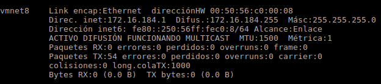
	* 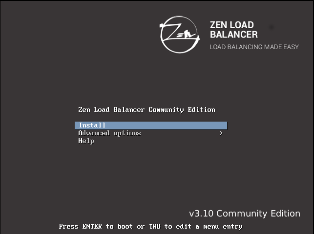
* Instalación
	* Elegir Idioma 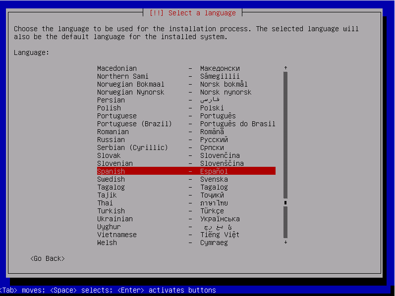
	* Ubicación 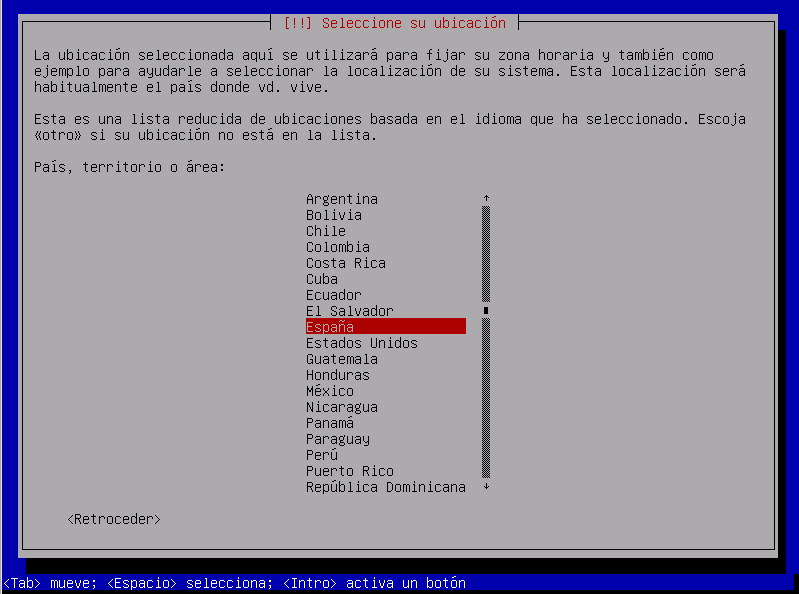
	* Elegir configuración de teclado 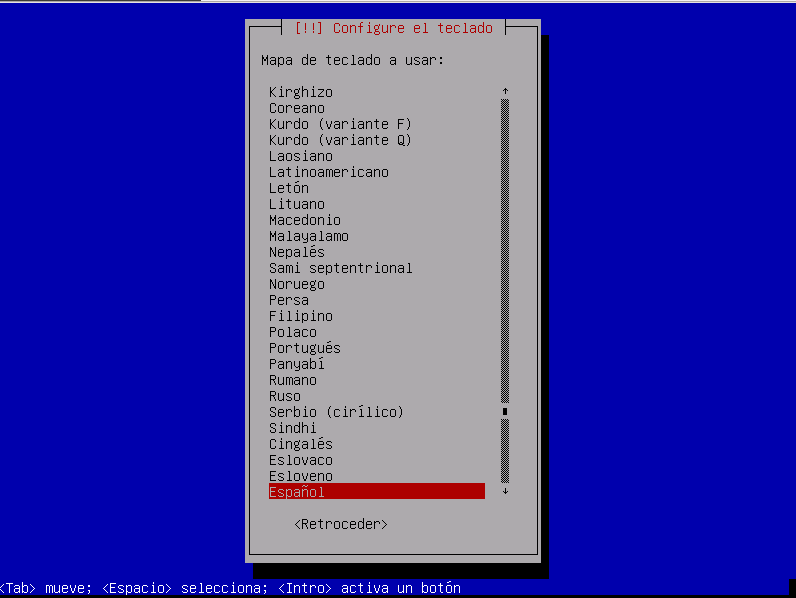
	* Red
		* Introducir Direccion IP 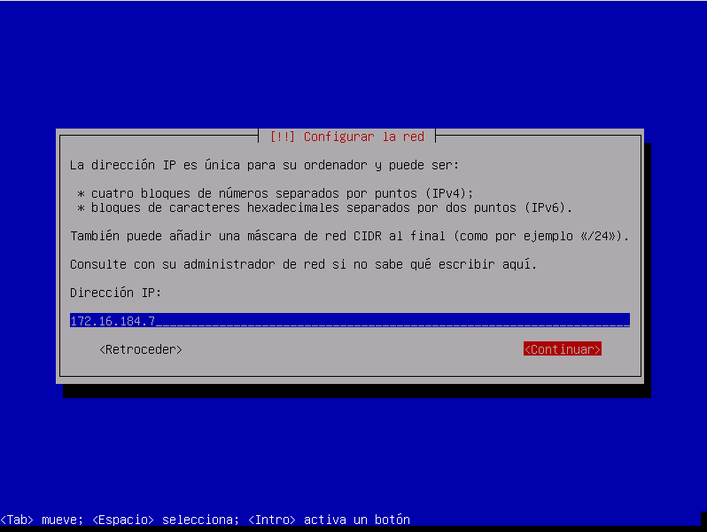
		* Introducir Mascara de subred 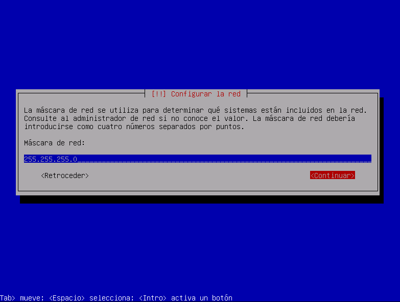
		* Introducir Puerta de enlace (Pasarela) 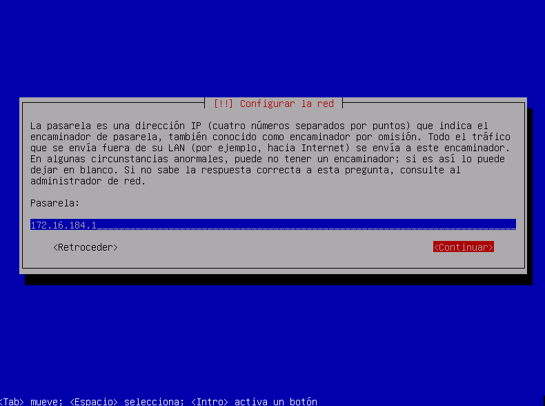
		* Introducir Servidor de DNS 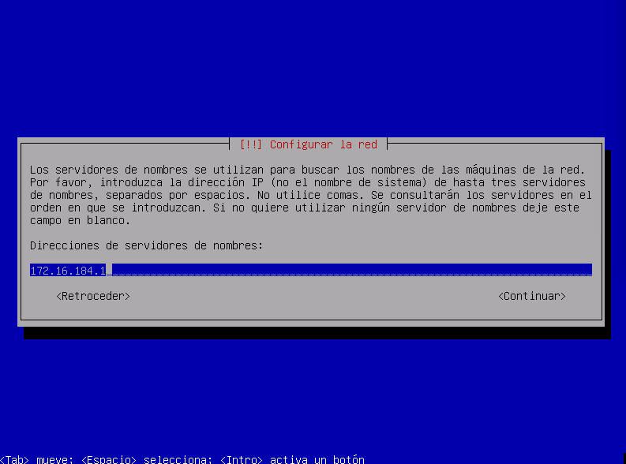
		* Nombre equipo 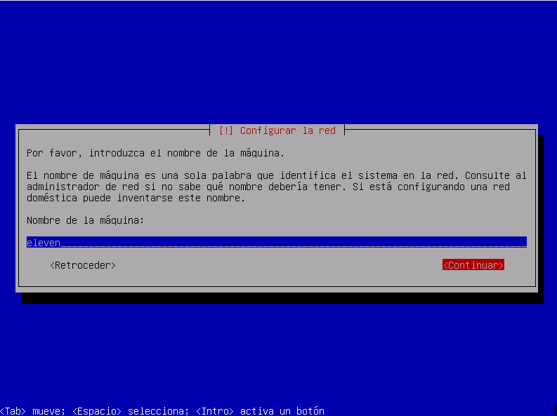
		* Seleccionar dominio 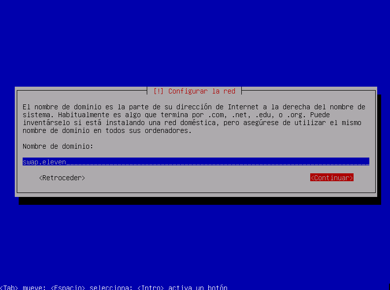
	* Contraseña root 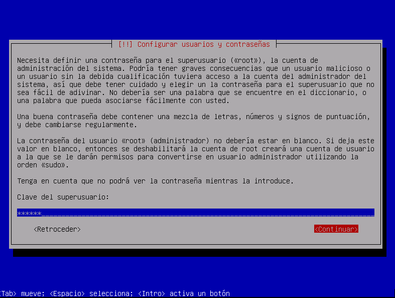 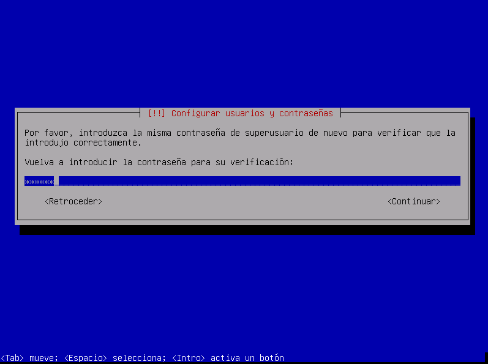
	* Configurar el reloj 
		* Seleccionar región 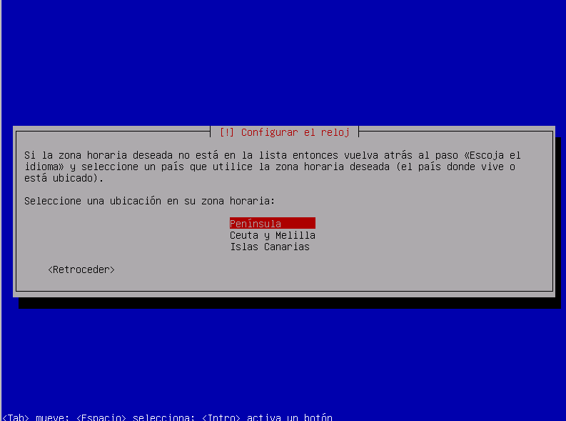
	* Utilización de discos
		* selección de modo o configuración
		* cargador de arranque GRUB  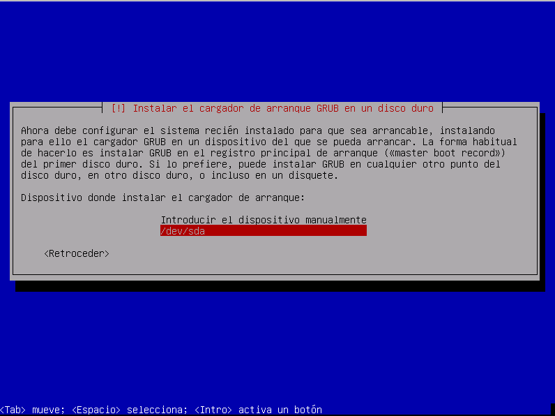 		

* Iniciar balanceador
	* iniciamos sesión como root 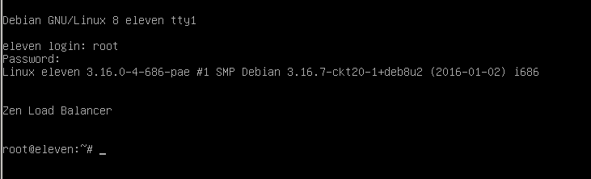
	
* Desde navegador del host accedemos a https://172.16.184.7:444/
	* Añadimos excepción de certificado 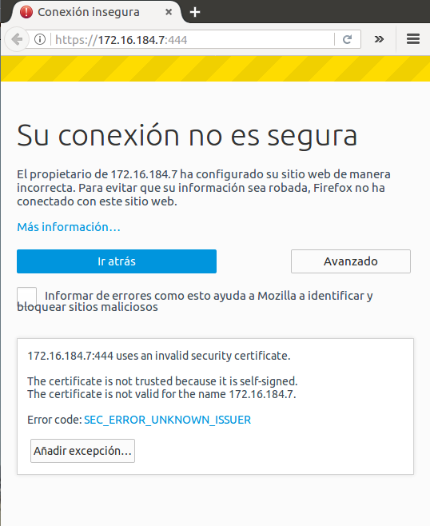
	* Introducimos usuario : admin contraseña: admin 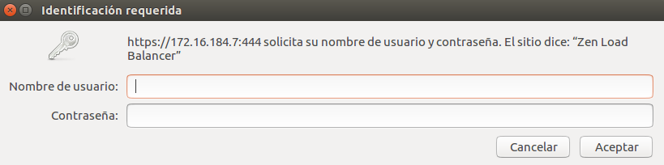
	* y ya hemos accedido 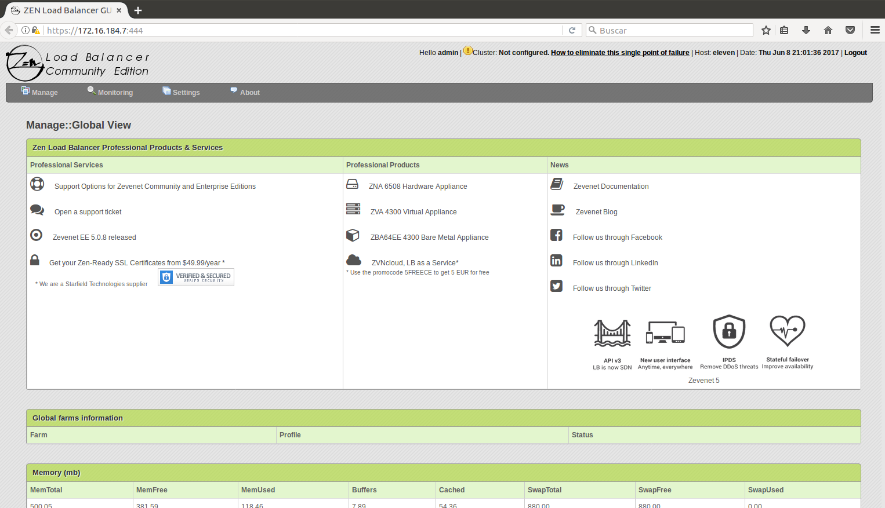

* Configurar Granja
	* Gestionamos granjas pulsando en Manage/Farms 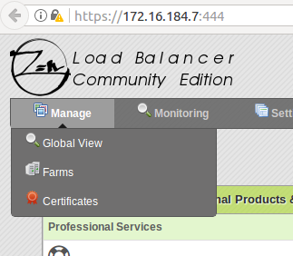
	* Creamos una nueva granja eligiendo L4xNAT 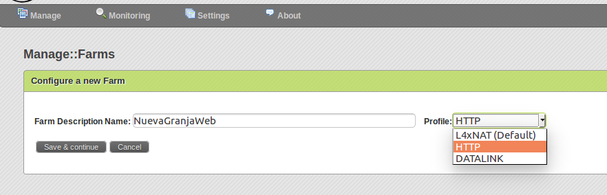 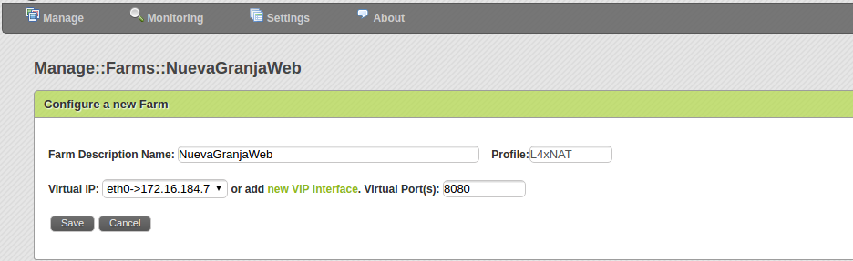 
	* En la tabla en la columna Actions pulsamos en el icono de en medio que editar granja 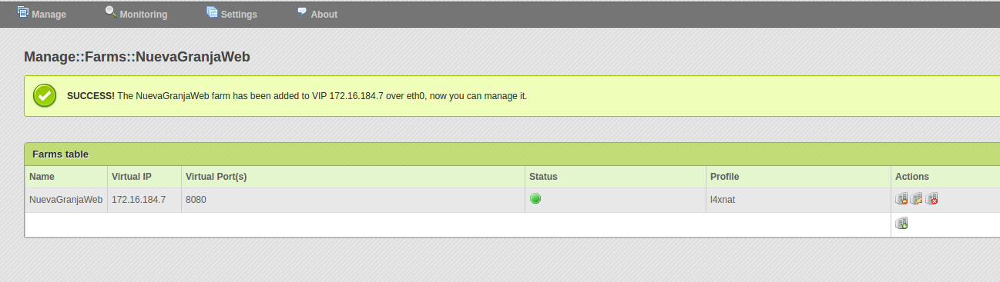 
	*En la tabla Edit real IP servers configuration 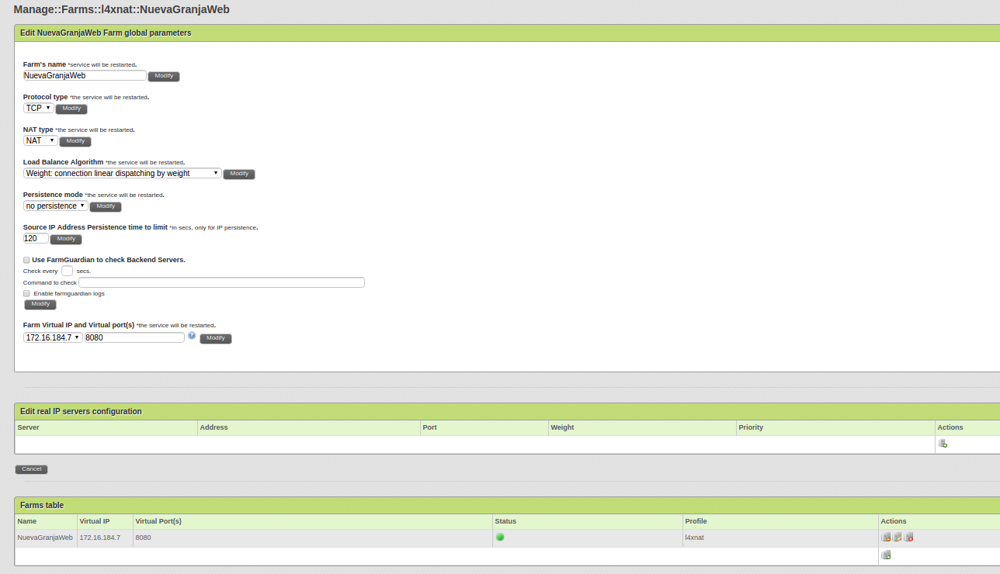 
		* podemos añadir todos los servidores que queramos desde el icono última fila de la columna Actions 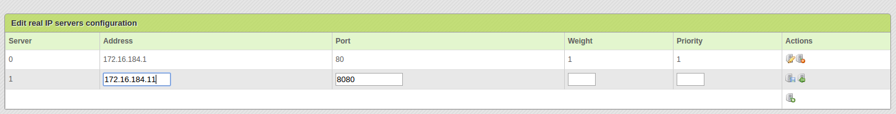 

* Comprobamos que funciona
	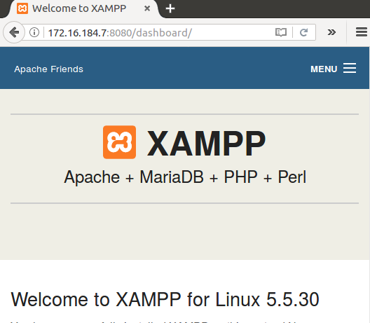 

## Ejercicio 4.5 Probar las diferentes maneras de redirección HTTP. ¿Cuál es adecuada y cuál no lo es para hacer balanceo de carga global? ¿Por qué?

Las redirecciones son comandos que permiten enviar a usuarios y buscadores de una URL  a otra automáticamente.

* **HTML** Envia la petición aunque el servidor este caído 
~~~ 
<meta http-equiv="acción"  url="destino" />
~~~		
o
~~~
<a href="destino">Enlace</a>
~~~
		
* **Javascript** Envia la petición a traves del navegador por lo tanto tambien puede estar el servidor caído
~~~
<body>

</body>
~~~

* **PHP** Envía la petición el servidor, si el servidor esta caído no la enviará

~~~
<?php
header ("Location: destino");
?>
~~~

* **ASP** Tambien la peticiónes que hace APP son del lado del servidor, si el servidor esta caído no la enviará
~~~
<% 
Response.Clear 
Response.Redirect ("http://www.dominio.com")
%>
~~~

Por lo tanto siempre son mejores las peticiones que se hacen desde el lado del servidor.

## Ejercicio 4.6 Buscar información sobre los bloques de IP para los distintos países o continentes. Implementar en JavaScript o PHP la detección de la zona desde donde se conecta un usuario
En esta [página]https://www.countryipblocks.net/allocation-of-ip-addresses-by-country.php  se ven organizados por países dependiendo del código de país

La extensión [GeoIP]http://php.net/manual/es/book.geoip.php permite buscar la localización de una dirección IP. Como la ciudad, estado, país, longitud, latitud y otro tipo de información como ISP y tipo de conexión puede ser obtenida con la ayuda de GeoIP.

Una vez instalada y configurada podemos probar un php como este:
~~~
$PAIS=geoip_country_name_by_name ('88.5.183.254');
$REGION=geoip_region_by_name ('88.5.183.254');
$CIUDAD=geoip_record_by_name ('88.5.183.254');
echo $CIUDAD[city]." ";
echo $REGION[region]." ";
echo $PAIS." ";
~~~
y nos dará un resultado como este:
 

## Ejercicio 4.7 Buscar información sobre métodos y herramientas para implementar GSLB.

___
***
- - -	
1. [IBM](https://www-03.ibm.com/systems/es/z/hardware/)
2. [IBM-Specificaciones](https://en.wikipedia.org/wiki/IBM_zEnterprise_System#Processors_and_memory)
3. [Fujitsu](http://www.fujitsu.com/global/products/computing/servers/mainframe/globalserver/)
4. [Curiosidad Mainframes ](http://www.digitalbizmagazine.com/agilidad-para-los-mainframes/)
5. [Global-mainframe-market-2017](http://www.sbwire.com/press-releases/global-mainframe-market-2017-ibm-usa-unisys-usa-814037.htm)
6. [Productos anteriores F5 Networks](https://worldtechit.com/f5-big-ip-1600-3600-3900-hardware-datasheet/)
7. [KEMP Loadmaster](https://kemptechnologies.com/es/server-load-balancing-appliances/product-matrix.html)
8. [F5 Networks](https://f5.com/es/products/deployment-methods/hardware)
9. [TP-LINK](http://www.tp-link.com/co/products/details/cat-4910_TL-R480T+.html#overview)
10. [sitmexico](http://www.sitmexico.com/balanceadores-de-carga.php)
11. [Medium-ordenador](https://www.pccomponentes.com/medion-erazer-p3616-d-amd-ryzen-5-1400-16gb-2tb-128gb-ssd-geforce-gtx1050ti)
12. [Bloqueo de IPS pais iptables](https://www.redeszone.net/2015/04/21/iptables-bloquear-paises-por-rango-de-ip/)
13. [Bloqueo de IPS pais iptables](https://www.olafrv.com/?p=786)