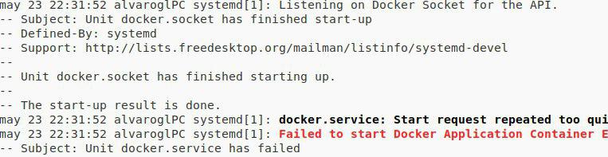
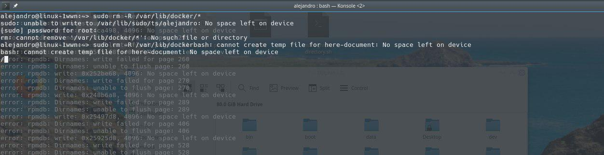

# ¡Hemos roto un Router!
 En las configuraciones de prueba que hicimos en su momento en una de las veces que vamos reiniciar el balanceador HAPROXY, el router desconecta la Wifi
* Creemos que era por que se habia calentado por estar colocado verticalmente cuando su forma correcta es horizontal
* El router al final sigue funcionando aunque nos diera ese pequeño susto

# Actualizaciones del sistema operativo en los días anteriores a la exposición
* Un integrante del grupo había actualizado el kernel del sistema operativo en lo dos días anteriores, en OpenSuse, y la noche anterior le habia pasado un kernel panic, pero seguía funcionando con docker, pues al día siguiente no se podían ejecutar algunos comandos, y tampoco iniciar los contenedores de docker que se tenian, ya que daba un error:

esto ocurre en la hora de prácticas y decidimos que cuando llegasemos a casa intentar solucionarlo de alguna forma.

* Estando haciendo pruebas y más intentando tener otras opciones por si fallan los principales ordenadores, Un compañero que acaba de hacer un examen llegaba a probar las confguraciones por si fallase algo, prueba arrancar docker en su maquína con Antergos y se encuentra con errores tambien

	* Despues de un rato se consiguen solucionar con una actulización y un reinicio del sistema

* Mientras que mis compañeros preguntan en el grupo de Telegram de Docker ES por si alguno de sus miembros le ha ocurrido para poder dar solución a esos errores, empiezo a crear copias de seguridad por si, ocurriese algo, que no fue así

* Parece que con la gente del grupo de Telegram Docker ES consiguén ayudar a mi compañero y una propuesta es que copie las carpetas que contienen los contenedores de la carpeta /var/lib/docker
~~~
du -sh /var/lib/docker
~~~
* desinstala docker completo aunque el paso más importante fue borrar el subvolumen del btrfs que parecia que es lo que estaba acaparando todo
~~~
btrfs subvolume delete /var/lib/docker/btrfs/subvolumes/*
~~~

* intenta copiar la carpeta de vuelta a docker de nuevo instalado y se queda sin espacio en disco 

* intentos de copiar archivos desde terminal

* Al final consigue hacer hueco en el disco duro y arrancar los contenedores de docker.

